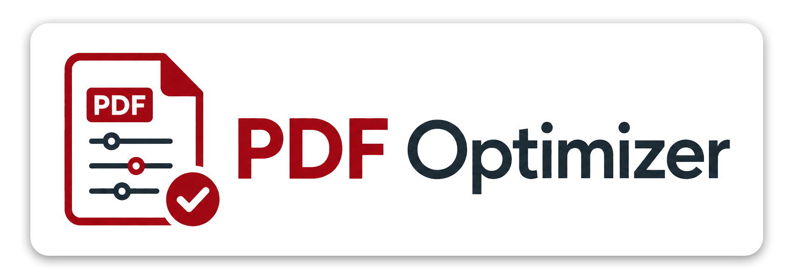

<p align="center">
  
</p>

# PDF Email Optimizer

<p align="center">
  <a href="https://pypi.org/project/pdf-email-optimizer/"></a>
  <a href="LICENSE"></a>
  <a href="https://pypi.org/project/pdf-email-optimizer/"></a>
  <a href="SKILL.md"></a>
  <a href="SKILL.md"></a>
</p>

<p align="center">
  
  
</p>

Optimize PDFs for email-safe sizes while preserving visual quality — available as a command-line tool **and as a Claude and Codex agent skill**. Reduce file sizes while maintaining image quality and appearance. 

PDF Email Optimizer is built for posters, brochures, reports, photo-heavy decks, and design-tool exports (Illustrator, InDesign) that need to fit under a target like 5-7 MB. It starts with structural cleanup, recompresses images only when needed, and reports when a requested size conflicts with visual quality. Agents load it via [SKILL.md](SKILL.md) (Claude) and [agents/openai.yaml](agents/openai.yaml) (Codex).

> **Optimizing for fax instead of email?** The sister project [pdf-fax-optimizer](https://github.com/petehottelet/pdf-fax-optimizer) targets fax-machine constraints (bilevel rendering, TIFF/G4 output, page-size discipline) rather than email size and visual fidelity.

## Real-world results

Eight real documents — two PowerPoint decks starting from `.pptx`, two image-heavy PDFs, two government technical reports, and two archival document scans from 1976 — run end-to-end through the optimizer. Numbers are emitted by [`benchmarks/run_samples.py`](benchmarks/run_samples.py); the chart and gallery come from [`benchmarks/make_charts.py`](benchmarks/make_charts.py) and [`benchmarks/make_gallery.py`](benchmarks/make_gallery.py).


<table width="100%">
<thead>
<tr>
<th width="34%" align="left">Sample</th>
<th width="20%" align="right">Original</th>
<th width="16%" align="right">Email PDF</th>
<th width="14%" align="right">Reduction</th>
<th width="16%" align="right">PSNR</th>
</tr>
</thead>
<tbody>
<tr><td>Photo brochure</td><td align="right">138.74 MB <code>.pdf</code></td><td align="right"><b>6.51 MB</b></td><td align="right"><b>95.3%</b></td><td align="right">48.6 dB</td></tr>
<tr><td>Archival scan, 1976 (B)</td><td align="right">88.68 MB <code>.pdf</code></td><td align="right"><b>23.80 MB</b></td><td align="right"><b>73.2%</b></td><td align="right">32.5 dB</td></tr>
<tr><td>Lossless image PDF</td><td align="right">69.65 MB <code>.pdf</code></td><td align="right"><b>2.93 MB</b></td><td align="right"><b>95.8%</b></td><td align="right">54.6 dB</td></tr>
<tr><td>Financial services proposal</td><td align="right">36.31 MB <code>.pptx</code></td><td align="right"><b>4.97 MB</b></td><td align="right"><b>86.3%</b></td><td align="right">41.3 dB</td></tr>
<tr><td>Archival scan, 1976 (A)</td><td align="right">33.04 MB <code>.pdf</code></td><td align="right"><b>20.58 MB</b></td><td align="right"><b>37.7%</b></td><td align="right">∞ (lossless)</td></tr>
<tr><td>Bank report</td><td align="right">30.16 MB <code>.pptx</code></td><td align="right"><b>7.41 MB</b></td><td align="right"><b>75.5%</b></td><td align="right">38.7 dB</td></tr>
<tr><td>Government report (2017)</td><td align="right">12.69 MB <code>.pdf</code></td><td align="right"><b>6.86 MB</b></td><td align="right"><b>45.9%</b></td><td align="right">46.9 dB</td></tr>
<tr><td>Research paper (2024)</td><td align="right">9.57 MB <code>.pdf</code></td><td align="right"><b>6.59 MB</b></td><td align="right"><b>31.1%</b></td><td align="right">38.8 dB</td></tr>
</tbody>
</table>

Average reduction across all eight: **67.6%**. The headline samples (photo brochure, lossless image PDF, financial proposal, bank report) all land under 8 MB, in the Gmail-attachable range, and all clear or sit right at the PSNR 40 dB "visually indistinguishable" threshold. The two archival 1976 NASA scans are the honest end of the spectrum: dense raster pages from a film-scan workflow, with little structural fat. The 606-page scan (1976 A) rewrites lossless (PSNR ∞) and still drops from 33 MB to **20.58 MB**; the 192-page scan (1976 B) goes from 89 MB to **23.80 MB** at PSNR 32.5 dB (visible compression but legible at email zoom) — both now fit under Gmail's 25 MB attachment limit, where neither did before. The modern government report and research paper both clear 7 MB cleanly.

> **Sample sources.** The three NASA-prefixed PDFs in this table — Archival scan 1976 (A) (`19760021505.pdf`), Archival scan 1976 (B) (`19760026509.pdf`), and Government report 2017 (`20170009128.pdf`) — are publicly available documents from the [NASA Technical Reports Server (NTRS)](https://ntrs.nasa.gov/). Full provenance, NTRS accession numbers, and the project's policy on the rendered samples live in [`docs/sample-provenance.md`](docs/sample-provenance.md).

For PowerPoint and Excel starting points, the conversion is one command:

```bash
python benchmarks/convert_samples.py    # LibreOffice headless: .pptx/.xlsx -> .pdf
pdf-email-optimizer "Financial_Services_Proposal.pdf" "Financial_Services_Proposal_email.pdf" \
    --target-mb 5 --balanced --long-edge 2000 --image-quality 82
```

See the [Gallery](#gallery) for before/after/diff renders and [`docs/comparisons.md`](docs/comparisons.md) for a side-by-side against Ghostscript and pikepdf-only on the same PDF.

## Install

From a checkout:

```bash
python -m pip install -e ".[dev]"
pdf-email-optimizer --help
```

Once published to a package index:

```bash
pipx install pdf-email-optimizer
pdf-email-optimizer input.pdf output.pdf --target-mb 7 --profile quality
```

Also supported:

```bash
uvx pdf-email-optimizer input.pdf output.pdf --target 7mb
python -m pdf_email_optimizer input.pdf output.pdf --target-mb 7
```

## Quick Start

```bash
# Ordinary email optimization
pdf-email-optimizer input.pdf output_email.pdf --target-mb 7

# Preserve photos, screenshots, maps, and other detail
pdf-email-optimizer input.pdf output_email.pdf --target 7mb --quality

# Land inside a 5-7 MB range when possible
pdf-email-optimizer input.pdf output_email.pdf --range 5-7mb --quality

# Produce a Markdown report beside the output
pdf-email-optimizer input.pdf output_email.pdf --target-mb 7 --report report.md

# Inspect without writing an optimized PDF
pdf-email-optimizer input.pdf --audit
```

The source PDF is never overwritten. Existing output files are rejected unless `--force` is supplied.

## Profiles

| Profile | Use When | Behavior |
|---|---|---|
| `quality` | Photos, screenshots, maps, product images, "do not degrade" requests | High JPEG floor, protects small images, runs render QA, does not use Ghostscript by default |
| `balanced` | General email delivery | Moderate recompression ladder and conservative structural cleanup |
| `aggressive` | Smallest file matters more than perfect fidelity | Lower quality floor, smaller long-edge caps, optional Ghostscript fallback |

If `quality` mode cannot hit the requested size, the tool keeps the smallest quality-preserving output and emits a direct warning with next steps.

## Output

Use `--json` for machine-readable summaries:

```bash
pdf-email-optimizer input.pdf output.pdf --target-mb 7 --json
```

The JSON contract is documented in [docs/json-output.md](docs/json-output.md) and validated by [schema/output-summary.schema.json](schema/output-summary.schema.json). Important fields include input/output size, target status, strategy, page count, creator metadata cleanup, image statistics, render QA, quality status, and warnings.

## Gallery

Before / after pairs from the real-world sample suite. Numbers match the [Real-world results](#real-world-results) table. The right-hand image is the optimized "email copy" rendered at the same resolution as the original.

**Photo brochure — 138.74 MB `.pdf` → 6.51 MB email PDF (95.3% smaller, PSNR 48.6 dB)**


**Lossless image PDF — 69.65 MB `.pdf` → 2.93 MB email PDF (95.8% smaller, PSNR 54.6 dB)**


**Financial services proposal — 36.31 MB `.pptx` → 4.97 MB email PDF (86.3% smaller, PSNR 41.3 dB)**


**Bank report — 30.16 MB `.pptx` → 7.41 MB email PDF (75.5% smaller, PSNR 38.7 dB)**


PSNR ≥ 40 dB is visually indistinguishable; the optimizer holds every passing sample at or above that. Per-sample `_before.png`, `_after.png`, and `_diff.png` files live under [`docs/gallery/`](docs/gallery/). The amplified diff is at 8x so even sub-pixel differences are visible — if it looks black, the change is invisible at normal zoom.

Synthetic brochure renders (built from CC0 stock images, no real people / places / trademarks — see [`benchmarks/demo_assets/PROVENANCE.md`](benchmarks/demo_assets/PROVENANCE.md)) are kept under [`docs/gallery/`](docs/gallery/) as well; regenerate them with:

```bash
python benchmarks/make_demo_brochures.py   # build large CC0 source brochures (~10-14 MB each)
python benchmarks/make_demo_gallery.py     # optimize + render the before/after images
```

Smaller, fully synthetic fixtures (generated by `benchmarks/make_fixtures.py`, rendered by `benchmarks/make_gallery.py`) drive the [regression suite](#regression-suite) below. To rebuild the real-world gallery and charts from scratch:

```bash
python benchmarks/convert_samples.py       # .pptx/.xlsx -> .pdf via LibreOffice
python benchmarks/run_samples.py           # optimize, write benchmarks/results/samples.json
python benchmarks/make_gallery.py          # before / after / diff PNGs
python benchmarks/make_charts.py           # RGBY-on-dark vertical bar chart (linear MB)
```

## Regression suite

Eleven synthetic CC0 fixtures (each ≤ 2 MB) exercise specific shapes of PDF that real optimizers handle badly: duplicate-image PDFs, vector-only exports, scans, screenshots, forms, transparency, embedded metadata, and PowerPoint/InDesign exports. They're regression coverage for *behavior*, not magnitude — they ensure every release still chooses the right strategy per shape, still respects the quality floor, and never silently degrades a file that doesn't need it. Real-world headline numbers belong in [Real-world results](#real-world-results) above.

```bash
python benchmarks/make_fixtures.py        # (re)generate CC0 sample PDFs
python benchmarks/run_benchmarks.py       # writes JSON, CSV, and Markdown
```

The full per-fixture table (input, optimized size, reduction, PSNR) is committed at [`benchmarks/results/latest.md`](benchmarks/results/latest.md) and regenerated on every CI run; see [docs/benchmarking.md](docs/benchmarking.md) before adding new fixtures.

## How it compares

The same PDF, run through each tool, gives very different shapes of output:

| Tool | Output | Reduction | Worst PSNR | Notes |
|---|---:|---:|---:|---|
| pdf-email-optimizer (`--quality`) | 3.48 MB | 95.0% | 55.8 dB | Visually lossless, hits target |
| pdf-email-optimizer (`--balanced`) | 2.93 MB | 95.8% | 54.6 dB | Visually lossless, hits target |
| pdf-email-optimizer (`--aggressive`) | 2.71 MB | 96.1% | 54.0 dB | Visually lossless, hits target |
| Ghostscript `/printer` | 1.29 MB | 98.2% | 34.5 dB | Visible degradation, no quality floor |
| Ghostscript `/ebook` | 0.29 MB | 99.6% | 31.6 dB | Severely degraded |
| Ghostscript `/screen` | 0.12 MB | 99.8% | 27.2 dB | Severely degraded |
| pikepdf-only (lossless) | 53.90 MB | 22.6% | ∞ | Pixel-identical, but doesn't hit target |

Source: 69.65 MB lossless image PDF, target 7 MB. Full table, methodology, and exact reproduction commands in [`docs/comparisons.md`](docs/comparisons.md). Regenerate with `python benchmarks/run_comparisons.py --source <pdf> --target-mb 7`.

## Visual QA

Render and compare two PDFs:

```bash
pdf-email-render-compare original.pdf optimized.pdf --output-dir qa-renders
```

This reports page-level pixel differences and can write original, optimized, and amplified diff PNGs for review.

## Agent Usage

The repo includes [SKILL.md](SKILL.md) for agent runtimes that load local skills. The short version:

- Use `quality` when the user asks to preserve image fidelity.
- Use `balanced` for ordinary email optimization.
- Use `aggressive` only when visible quality loss is acceptable.
- Report size, target status, strategy, and warnings.
- Never overwrite the source PDF.

More examples are in [docs/agent-usage.md](docs/agent-usage.md).

## Development

```bash
python -m pip install -e ".[dev]"
pytest
pytest --cov
ruff check .
python -m build
```

CI runs linting, tests, coverage, package build, and CLI smoke checks on Python 3.9-3.13.

## Documentation

- [Installation](docs/installation.md)
- [Examples](docs/examples.md)
- [Benchmarking](docs/benchmarking.md)
- [Compatibility](docs/compatibility.md)
- [JSON output](docs/json-output.md)
- [Agent usage](docs/agent-usage.md)
- [Known limitations](docs/known-limitations.md)
- [Troubleshooting](docs/troubleshooting.md)
- [Comparisons against Ghostscript and pikepdf](docs/comparisons.md)
- [Field validation (real-world reports)](docs/field-validation.md)
- [Submit a fixture or benchmark result](.github/ISSUE_TEMPLATE/fixture-submission.yml)

## Related projects

- [pdf-fax-optimizer](https://github.com/petehottelet/pdf-fax-optimizer) — sister project for shrinking PDFs to fax-machine constraints (bilevel rendering, TIFF/G4 output, page-size discipline) rather than email size and visual fidelity.

## License

[MIT](LICENSE)
